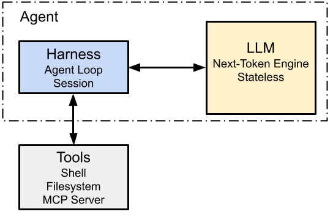
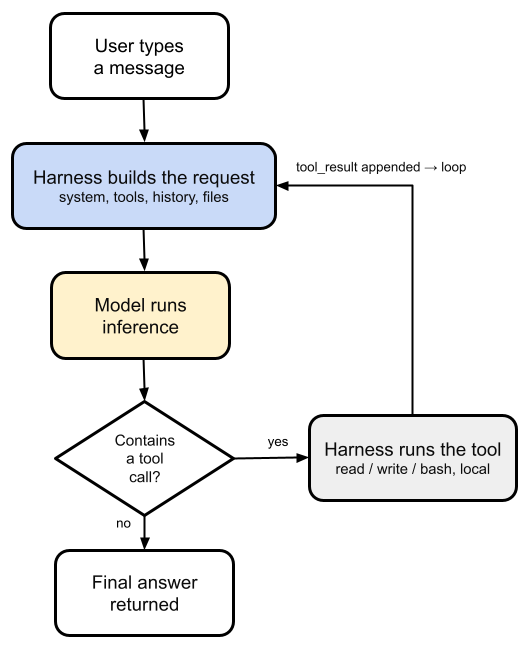
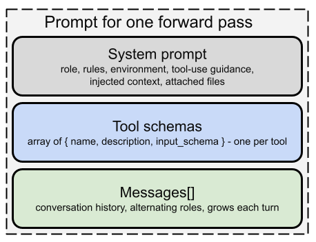

# Coding Agent Architecture
 
A coding agent is not a monolithic application but consists of several 
components, both on the client side and on the server side.

## Agent Components 

A coding agent consists of three components: 

### Model
The model is the neural network itself: the trained weights plus the inference
stack that runs them. Functionally it's a single **pure function** (a sequence of 
tokens goes in, a probability distribution over the next token comes out). 
That's the entire capability. It's **stateless** (no memory between calls), 
**passive** (it cannot call itself, run anything, or reach the outside world), 
and **bounded** by the context window. 
All the _intelligence_ lives here, but on its own the model is inert: it can 
emit a `tool_use` block describing an action, but it physically cannot perform 
that action. It just predicts what should come next.

### Harness

The harness is the ordinary program that wraps and drives the model, also called: 
the scaffold, runtime, orchestrator, or agent loop. It's plain software with no ML 
in it, running **client-side** (on our machine). Its job is everything the model 
can't do for itself: assemble the prompt each turn, call the model, parse the 
response, execute the tool calls the model requested, enforce permissions, manage 
context and compaction, and persist the session to disk. The harness is what turns 
a passive next-token predictor into something that gets work done in a loop. 
Deterministic plumbing wrapped around a probabilistic engine.

**Session** is the persisted state (the JSONL transcript from the earlier discussion)
and it functions as the agent's memory. This matters because the model is stateless: 
it remembers nothing between calls, so the session store is the only thing that carries 
continuity. It's what the harness replays into the prompt every turn, and it's what 
lets us close the terminal and resume days later. It holds the whole event stream: 
messages, tool calls, tool results, and metadata.

### Tools 

**Tools** are the concrete capabilities the model can invoke to reach outside its own 
token stream: `read_file`, `write_file`, edit, bash, grep/glob, `web_fetch`, plus 
anything an MCP server contributes. Each tool has two halves living in different 
places:

- **Schema**: A JSON description of the tool's name, purpose, and parameters, 
    it rides along in the prompt so the model even knows the tool exists and how 
    to call it. 
    
- **Executor**: The actual code that runs the shell command or writes the file, 
    it lives in the harness. 
    
So tools are the agent's hands and senses: output tools like bash and write act 
on the world, input tools like read and grep perceive it. Without them the model 
can only produce text. Tools are precisely what convert "the model describes an 
action" into "the action happens." And to restate the division of labor, the model 
never runs a tool, it emits a `tool_use` request, the harness executes it, and 
the outcome returns as a `tool_result`.

### Agent = LLM + Harness 

The **agent** is the whole system that emerges when a harness drives a model 
in a loop with tools, pursuing a goal. The defining property of an agent is that 
the model directs its own control flow. Given a goal, it decides which tools to call, 
in what order, and when the task is finished, rather than following a script the 
harness author fixed in advance.

## Client-Server Architecture

### Client Side

On the **client side** (e.g. the Claude Code CLI, a Node.js process) 
we have essentially everything except the model:

- **Agent harness** (orchestration loop): The control program that decides 
	when to call the model, parses what comes back, dispatches tools, and 
	loops.

- **Tool executors**: The actual implementations of `read_file`, `write_file`, 
	edit, bash, grep/glob, web_fetch, etc. These run locally. When the model 
	"edits a file," it doesn't; it emits a structured request and the harness 
	performs the write.

- **Context assembler**: The code that builds each request (system prompt, 
	tool schemas, history, `CLAUDE.md`, previously-read file contents).

- **Permission/approval layer**: Gates dangerous tool calls behind user 
	confirmation.

- **Session store**: Local transcript persistence.

- **MCP client**: If we use MCP servers (which may themselves be local or 
	remote).

### Server Side

On the **server side** we have surprisingly little of what we would call 
_the agent_:

- **Inference endpoint** (/v1/messages) and the model weights + inference 
	stack: This is where the LLM actually runs.

- **Prompt-caching infrastructure**: A transient, performance-only cache 
    of the request prefix (lives minutes, not a session store).

- **Safety/moderation classifiers** and, for some tools (e.g. server-side web 
	search), a server-executed tool path.

## Agentic Loop

The following figure shows the agentic loop.
One lap around this figure equals exactly one model call plus whatever tools 
that call asks for.

The user sends a message; the harness builds the request (system prompt, 
tool schemas, full history, files); the model runs one inference and returns 
either plain text or a response containing tool calls; the harness checks 
"contains a tool call?"; if yes, it runs the tool locally, appends the result, 
and goes back to "build the request", that back-edge is the loop; if no, 
the response is the final answer and the loop exits. 
The whole thing repeats until the model returns a turn with no tool calls.

Note that **failed tool calls** don't break the loop, they feed back as 
observations. A non-zero exit code, a compiler error, an exception: the 
harness captures it and appends it as the `tool_result` just like any 
other. The model sees the failure on the next lap and can adapt, retry with 
different arguments, fix the code, or change approach. This is a big part 
of why the pattern is powerful: 
**the environment's pushback becomes part of the model's reasoning input** 
rather than a crash.

## Anatomy of a Prompt

The prompt entered by the user is not sent directly to the LLM. 
In fact, the **sent prompt consists of several parts**.

There are three top-level slots, and they map to three API 
parameters: system, tools, and messages. Everything else we would 
think of as "part of the prompt" is folded into one of these.

* **System Prompt**:
    This serves as the foundational layer that establishes the 
    agent's overall baseline and constraints. It defines:

    - **Role & Rules**: The persona the agent should adopt and 
        the strict boundaries it must follow.

    - **Environment & Tool-use Guidance**: Context about where 
        the agent is operating and instructions on how it 
        should handle its available tools.

    - **Injected Context & Attached Files**: Any relevant project 
        data, codebases, or documents fed into the agent to give 
        it immediate domain knowledge.

* **Tool Schemas**:
    This layer acts as the agent's interface to external functionalities. 
    It consists of an array of objects, one per tool.
    This explicit structure tells the coding agent exactly what capabilities 
    it has access to and precisely how to format the arguments to trigger them.

* **Messages[]**
    This is a dynamic, growing array that tracks the actual execution flow. 
    It contains:

    - **Conversation history**: The ongoing record of the task.

    - **Alternating roles**: The back-and-forth dialogue or interaction 
    turns (e.g., user requests, agent thoughts/actions).

    - **Tool results**: Because the agent needs to see the result of 
    the tool it just invoked to decide on its next move, that `tool_result`
    is appended directly to the Messages[] array.

    This Messages[] section **expands with each turn** as the agent iteratively 
    works through the coding problem.

## References 

* [YouTube (Matt Pocock): Most devs don't understand what agents are](https://youtu.be/AtYtuVTZCQU?si=ZK9oq8_6-hO7p-BC)

* [Birgitta Böckeler: Harness engineering for coding agent users](https://www.martinfowler.com/articles/harness-engineering.html)

* [How Claude Code works](https://code.claude.com/docs/en/how-claude-code-works)

*Egon Teiniker, 2026, GPL v3.0*