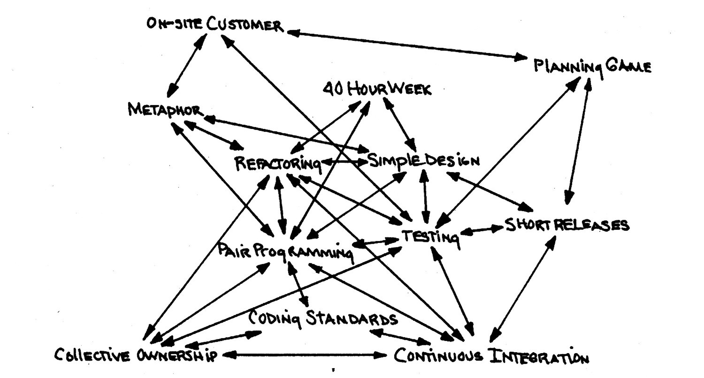

# Extreme Programming in the Context of Coding Agents 

Extreme Programming (XP) is an agile software development framework developed
by Kent Beck, designed to improve software quality and responsiveness to
changing customer requirements. It thrives on
frequent releases in short development cycles, which introduces checkpoints
where new customer requirements can be adopted. To achieve this, XP relies on a
set of interconnected practices organized across four dimensions.

## Core Engineering Practices

These are the technical habits that keep the code clean, flexible, and
reliable.

* **Test-Driven Development (TDD)**: Developers write an automated
    unit test before writing the actual code. Once the test fails, they write
    the minimum code required to make it pass, and then refactor.
    _In Agentic Engineering_:The
    test are written before the agent implements a feature, so the
    agent has an executable definition of "done" and can verify its own
    result by running the test instead of the developer eyeballing the diff.

* **Pair Programming**: Two developers work together at one
    workstation. One (the **Driver**) writes the code, while the other (the
    **Navigator**) reviews each line, watches for tactical defects, and
    thinks strategically about the bigger picture.
    _In Agentic Engineering_: The agent takes the Driver role and writes
    the code, while the developer takes the Navigator role, reading each
    generated diff, correcting the plan before implementation starts, and
    steering the next step instead of typing the code.

* **Refactoring**: Continuous disciplined optimization of the
    internal structure of the code without changing its external behavior. It
    removes duplication and improves readability.
    _In Agentic Engineering_: The agent is asked to restructure code
    (e.g. toward Clean Architecture) one verifiable step at a time, compiling
    and running the tests after each step, so behavior preservation is
    checked continuously instead of assumed.

* **Simple Design**: The team builds the simplest thing that works.
    Extra features or speculative architecture for future needs are avoided
    (often summed up as YAGNI: ``You Ain't Gonna Need It'').
    _In Agentic Engineering_: A context file (e.g. `CLAUDE.md`) states the
    YAGNI rule explicitly for the agent, since a language model left
    unconstrained tends to add abstractions, error handling and options the
    task never asked for.

## Integration and Delivery Practices

These practices focus on how code moves from a developer's machine to the
actual product.

* **Continuous Integration (CI)**: Developers integrate their code
    into the main repository multiple times a day. Every merge triggers
    automated tests to detect integration errors as early as possible.
    _In Agentic Engineering_: An automated code-review agent runs on every
    commit or pull request, checking the diff for correctness and style
    issues the same way a test suite checks for regressions, before a human
    ever has to look at it.

* **Collective Code Ownership**: Anyone on the team can change any
    piece of code at any time. No single person becomes a bottleneck for a
    specific module, which distributes knowledge across the team.
    _In Agentic Engineering_: A context file and the git history stand in
    for tribal knowledge, so any agent session, on any part of the codebase,
    starts with the same background a long-time team member would have,
    instead of depending on one person's memory of why something is built
    the way it is.

* **Coding Standards**: The team agrees on a unified set of rules
    for writing code, making the codebase look like it was written by a single,
    highly consistent individual.
    _In Agentic Engineering_: The same rules live in the context file the
    agent reads before every task, so generated code follows the team's
    formatting and naming conventions automatically, without a separate
    review step just to catch style drift.

## Planning and Feedback Loops

XP relies on tight feedback loops between the business side and the technical
side to stay on track.

* **The Planning Game**: A collaborative meeting where business
    stakeholders define features as User Stories and prioritize them, 
    while the development team estimates the effort required.
    _In Agentic Engineering_: The agent turns user stories into a written
    implementation plan before touching any code, which the developer then
    reviews and corrects, catching a wrong assumption while it is still a
    one-line edit to a document instead of a change spread across files.

* **Small Releases**: The team delivers working software to
    production frequently, ensuring the customer gets value early and can
    provide real-world feedback.
    _In Agentic Engineering_: The agent implements one user story at a
    time, each one reviewed, verified and committed before the next begins,
    so every increment stays small enough to read end to end.

* **On-Site Customer**: A representative from the customer side sits
    with the development team full-time to answer questions and provide
    immediate feedback.
    _In Agentic Engineering_: The developer stays interactively available
    while the agent works, answering clarifying questions the agent asks
    mid-task instead of leaving it to guess at unstated requirements.

## Team Wellness and Environment

* **Sustainable Pace**: Teams should not work excessive overtime. XP
    holds that tired developers write lower-quality code, which slows down the
    project in the long run.
    _In Agentic Engineering_: An agent's output quality degrades in a long,
    cluttered context the same way a tired developer's does, so context is
    cleared between unrelated tasks, and unattended loops (e.g. a Ralph Loop)
    are gated behind an automated verification check rather than left running
    indefinitely on trust.

* **Metaphor**: The team defines a shared, easily understood analogy
    of how the target system works, keeping all stakeholders aligned on the
    system's architecture and purpose.
    _In Agentic Engineering_: The context file's architectural overview,
    together with diagrams such as `ClassDiagram.png`, plays the same role
    for the agent that the metaphor plays for the team, one shared picture
    of the system that every session starts from.

## References

* Kent Beck and Cynthia Andres. **Extreme Programming Explained: Embrace Change**. Addison-Wesley, 2nd Edition 2004

*Egon Teiniker, 2026, GPL v3.0*       