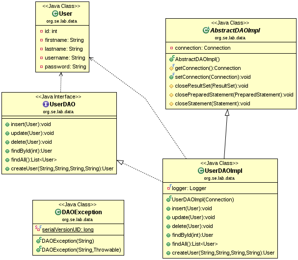

# Java Database Connectivity (JDBC)

JDBC is a Java-based API that enables Java applications to interact 
with databases. It provides **methods for querying and updating data** 
in a database and is part of the Java Standard Edition platform.

## Key Components of JDBC

* **JDBC Drivers**:
    * **Type 1: JDBC-ODBC Bridge Driver**: Converts JDBC calls into 
    ODBC calls and directs them to the ODBC driver.

    * **Type 2: Native-API Driver**: Converts JDBC calls into 
    database-specific calls using native API.

    * **Type 3: Network Protocol Driver**: Uses a middle-tier server 
    to convert JDBC calls into database-specific protocol.

    * **Type 4: Thin Driver**: Directly converts JDBC calls into 
    database-specific protocol without native code.

* **JDBC API**:

    * **DriverManager**: Manages a list of database drivers. It matches 
        connection requests from the Java application with the appropriate 
        driver using a set of database connection parameters.

    * **Connection**: Represents a session/connection with a specific 
        database. It provides methods for creating statements, committing 
        transactions, etc.

    * **Statement**: Used for executing SQL queries. There are three 
        types of statements:
        * **Statement**: Used for executing simple SQL queries without 
            parameters.
        * **PreparedStatement**: Used for executing precompiled SQL 
            queries with or without parameters.
        * **CallableStatement**: Used for executing stored procedures 
            in the database.
    
    * **ResultSet**: Represents the result set of a query. It provides 
    methods for retrieving and manipulating the data returned by a query.
    
    * **SQLException**: Handles SQL errors and exceptions.

## Data Access Object Implementation

In this example, the operations of a DAO are implemented using JDBC.



### Setup

To start the example, the database server must first be started:
```
$ sudo systemctl start mariadb.service
```

Then the settings in the `src/test/resources/jdbc.properties` file
must be checked (just rename the `jdbc.properties.template` file).

Here are the default settings for the Virtual Lab VM:
```
jdbc.driver=com.mysql.cj.jdbc.Driver
jdbc.url=jdbc:mysql://localhost:3306/testdb
jdbc.username=student
jdbc.password=student
```

After these settings, the given test cases can be easily executed.

