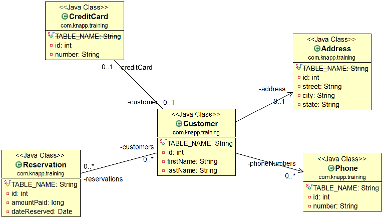

# JPA Relationships

## Introduction

### Why Class Relationships Differ From Table Relationships

In object-oriented programming, relationships between classes and in relational databases are fundamentally different concepts:

**Table Relationships (Relational Model):**
- Tables are connected through **foreign keys**: columns that reference primary keys in other tables
- The relationship is **unidirectional in structure**: only the child table contains a reference to the parent
- Navigation only works through explicit `JOIN` queries
- Data is normalized to avoid redundancy

**Class Relationships (Object Model):**
- Objects hold **references** to other objects (or collections of objects) through fields
- The relationship can be **navigable in one or both directions**: an object can directly access related objects through properties
- Navigation is immediate: `customer.getAddress()` directly returns the `Address` object
- Objects can represent relationships using multiple fields pointing to the same logical entity

 **Java Persistence API (JPA)** bridges this gap by mapping object relationships to database relationships. The annotations define how object references map to foreign keys and join tables, allowing you to navigate object graphs while Hibernate/JPA handles the SQL generation and database synchronization.




## One-to-One Directed: Customer --[1]-> Address  

### Annotations in the Source Code

In the **Customer** class, the one-to-one relationship is defined using the `@OneToOne` annotation:

```java
@OneToOne(cascade={CascadeType.ALL})
@JoinColumn(name="ADDRESS_ID")
private Address address;
```

- `@OneToOne` — Declares a one-to-one relationship. This is a **unidirectional** relationship (only Customer knows about Address).
- `cascade={CascadeType.ALL}`: Specifies that when a Customer is persisted, updated, or deleted, the same operations cascade to its associated Address.
- `@JoinColumn(name="ADDRESS_ID")`: Specifies the **foreign key column** in the CUSTOMER table that references the ADDRESS table. This annotation marks Customer as the **owning side** of the relationship.

The **Address** class has no relationship annotations back to Customer (it doesn't need to know about the customer).

### SQL Relations Between Tables

The one-to-one relationship creates two separate tables with a foreign key:

```sql
create table ADDRESS (
	id number(10,0) not null,
	city varchar2(255 char),
	state varchar2(255 char),
	street varchar2(255 char),
	primary key (id)
)

create table CUSTOMER (
	id number(10,0) not null,
	firstName varchar2(255 char),
	lastName varchar2(255 char),
	ADDRESS_ID number(10,0),
	CREDIT_CARD_ID number(10,0),
	primary key (id),
	foreign key (ADDRESS_ID) references ADDRESS,
)
```

- `ADDRESS_ID` is a **foreign key** in `CUSTOMER` that references the `id` of `ADDRESS`
- Each customer can have exactly one address (enforced by the database constraint)
- The foreign key is on the **owning side** (Customer), matching the `@JoinColumn` annotation
- To fetch a customer with their address, the database must JOIN the two tables


## One-to-One Bidirectional: Customer --[1]---[1]-- CreditCard

### Annotations in the Source Code

In the **Customer** class (owning side):

```java
@OneToOne(cascade={CascadeType.ALL})
@JoinColumn(name="CREDIT_CARD_ID")
private CreditCard creditCard;
```

In the **CreditCard** class (inverse side):

```java
@OneToOne(mappedBy="creditCard")
private Customer customer;
```

- **Customer side (owning):** Uses `@OneToOne` with `@JoinColumn(name="CREDIT_CARD_ID")`.
This side owns the relationship and defines the foreign key column in the database.
- **CreditCard side (inverse):** Uses `@OneToOne(mappedBy="creditCard")`. This specifies that the relationship is already defined on the Customer class via the `creditCard` field. The CreditCard does not own the relationship; it just provides a way to navigate back to the Customer.
- `cascade={CascadeType.ALL}`: Only on the owning side, ensures cascading operations.

**Navigation:**
```java
customer.getCreditCard();      // Navigate from Customer to CreditCard (direct)
creditCard.getCustomer();      // Navigate from CreditCard to Customer (via mappedBy)
```

### SQL Relations Between Tables

```sql
create table CREDIT_CARD (
	id number(10,0) not null,
	CARD_NUMBER varchar2(255 char),
	primary key (id)
)

create table CUSTOMER (
	id number(10,0) not null,
	firstName varchar2(255 char),
	lastName varchar2(255 char),
	ADDRESS_ID number(10,0),
	CREDIT_CARD_ID number(10,0),
	primary key (id),
	foreign key (CREDIT_CARD_ID) references CREDIT_CARD
)
```

- The foreign key `CREDIT_CARD_ID` is in `CUSTOMER` (the owning side)
- Despite being bidirectional in the object model, the database still 
has **only one foreign key direction**
- JPA ensures consistency: when we set `creditCard.setCustomer(customer)`, the `@JoinColumn` reference is maintained automatically
- Both sides can navigate to each other, but only the owning side controls the database relationship


## One-to-Many Directed: Customer ---[*]-> Phone

### Annotations in the Source Code

In the **Customer** class:

```java
@OneToMany(cascade={CascadeType.ALL})
@JoinColumn(name="CUSTOMER_ID")
private List<Phone> phoneNumbers = new ArrayList<Phone>();
```

In the **Phone** class there are no relationship annotations.

- `@OneToMany`: Declares that one `Customer` can have many `Phone` numbers.
- `cascade={CascadeType.ALL}`: When a `Customer` is deleted, all associated 
	`Phone` objects are also deleted.
- `@JoinColumn(name="CUSTOMER_ID")`: Specifies that the foreign key 
	`CUSTOMER_ID` in the `PHONE` table references the `Customer`. 
	This makes `Customer` the **owning side** of the relationship.
- The `List<Phone>` collection allows navigating from a `Customer` to all 
	their phone numbers.

**Navigation:**
```java
customer.getPhoneNumbers();     // Get list of all phones for this customer
```

### SQL Relations Between Tables

```sql
create table PHONE (
	id number(10,0) not null,
	PHONE_NUMBER varchar2(255 char),
	CUSTOMER_ID number(10,0),
	primary key (id),
	foreign key (CUSTOMER_ID) references CUSTOMER
)

create table TEST_CUSTOMER (
	id number(10,0) not null,
	firstName varchar2(255 char),
	lastName varchar2(255 char),
	ADDRESS_ID number(10,0),
	CREDIT_CARD_ID number(10,0),
	primary key (id),
)
```

- The foreign key `CUSTOMER_ID` is in `PHONE` (the "many" side in the database)
- One `Customer` can have multiple rows in `PHONE`, all referencing the same 
	`CUSTOMER_ID`
- Despite `@OneToMany` suggesting `Customer` owns the relationship, the 
	**foreign key is physically on the Phone table**. This is the standard 
	relational pattern.
- The `@JoinColumn` annotation on the `Customer` side instructs JPA to place 
	the foreign key on the `Phone` table, even though `Customer` owns the 
	relationship logically.


## Many-to-Many Bidirectional: Customer --[*]---[*]-- Reservation

### Annotations in the Source Code

In the **Reservation** class (owning side):

```java
@ManyToMany
@JoinTable(name="TEST_RESERVATION_CUSTOMER", 
	joinColumns={@JoinColumn(name="RESERVATION_ID")},
	inverseJoinColumns={@JoinColumn(name="CUSTOMER_ID")}
)
private List<Customer> customers = new ArrayList<Customer>();
```

In the **Customer** class (inverse side):

```java
@ManyToMany(mappedBy="customers")
private List<Reservation> reservations = new ArrayList<Reservation>();
```

- **Reservation side (owning):** Uses `@ManyToMany` to declare a 
	many-to-many relationship. 
- `@JoinTable`: Defines a **join table** (also called junction or 
	cross-reference table) that bridges `Reservation` and `Customer`.
  - `name="TEST_RESERVATION_CUSTOMER"`. The name of the join table
  - `joinColumns={@JoinColumn(name="RESERVATION_ID")}`: Foreign key 
  	column referencing `Reservation`
  - `inverseJoinColumns={@JoinColumn(name="CUSTOMER_ID")}`: Foreign 
  	key column referencing `Customer`.
- **Customer side (inverse):** Uses `@ManyToMany(mappedBy="customers")`. 
	This side doesn't own the relationship; it only provides reverse 
	navigation.
- Both sides use `List<T>` collections to represent the many-to-many 
	relationship.

**Navigation:**
```java
reservation.getCustomers();     // Navigate from Reservation to all its Customers
customer.getReservations();     // Navigate from Customer to all their Reservations
```

### SQL Relations Between Tables

```sql
create table RESERVATION (
	id number(10,0) not null,
	AMOUNT_PAID number(19,0),
	DATE_RESERVED timestamp,
	primary key (id)
)

create table RESERVATION_CUSTOMER (
	RESERVATION_ID number(10,0) not null,
	CUSTOMER_ID number(10,0) not null,
	foreign key (RESERVATION_ID) references RESERVATION,
	foreign key (CUSTOMER_ID) references CUSTOMER
)

create table CUSTOMER (
	id number(10,0) not null,
	firstName varchar2(255 char),
	lastName varchar2(255 char),
	ADDRESS_ID number(10,0),
	CREDIT_CARD_ID number(10,0),
	primary key (id),
)
```

- A separate **join table** `RESERVATION_CUSTOMER` is created to 
	represent the many-to-many relationship.
- The join table contains only foreign keys: `RESERVATION_ID` and 
	`CUSTOMER_ID`.
- Each row in the join table represents one customer participating 
	in one reservation.
- One `Reservation` can have multiple `Customers` (multiple rows 
	in the join table with the same `RESERVATION_ID`).
- One `Customer` can have multiple `Reservations` (multiple rows 
	in the join table with the same `CUSTOMER_ID`).
- The **owning side** (`Reservation`) defines the join table 
	structure via `@JoinTable`.
- The **inverse side** (`Customer`) only provides navigational 
	access via `mappedBy`.


## Generated DB Schema by Hibernate

The SQL statements below are automatically generated by Hibernate 
based on the entity classes and their relationship annotations. 
Compare them with the Class Diagram to understand how the object 
model maps to the relational schema:

```sql
create table ADDRESS (
	id number(10,0) not null,
	city varchar2(255 char),
	state varchar2(255 char),
	street varchar2(255 char),
	primary key (id)
)
```
- Simple entity table with no foreign keys (no incoming relationships).

```sql
create table CREDIT_CARD (
	id number(10,0) not null,
	CARD_NUMBER varchar2(255 char),
	primary key (id)
)
```
- Simple entity table for the `CreditCard`. 
	The reverse reference to `Customer` (via `mappedBy`) doesn't create 
	a foreign key here; only the owning side (`Customer`) holds the 
	foreign key.

```sql
create table CUSTOMER (
	id number(10,0) not null,
	firstName varchar2(255 char),
	lastName varchar2(255 char),
	ADDRESS_ID number(10,0),
	CREDIT_CARD_ID number(10,0),
	primary key (id),
	foreign key (ADDRESS_ID) references ADDRESS,
	foreign key (CREDIT_CARD_ID) references CREDIT_CARD
)
```
- Contains two foreign keys: `ADDRESS_ID` (one-to-one unidirectional) 
	and `CREDIT_CARD_ID` (one-to-one bidirectional owning side).
- Both relationships are defined via `@JoinColumn` in the `Customer` entity.

```sql
create table PHONE (
	id number(10,0) not null,
	PHONE_NUMBER varchar2(255 char),
	CUSTOMER_ID number(10,0),
	primary key (id),
	foreign key (CUSTOMER_ID) references CUSTOMER
)
```
- Contains `CUSTOMER_ID` foreign key (one-to-many relationship).
- Even though `Customer` owns the one-to-many relationship, the 
	foreign key is physically on the `Phone` table. This is the 
	standard relational design.
- Multiple `Phone` rows can reference the same CUSTOMER_ID.

```sql
create table RESERVATION (
	id number(10,0) not null,
	AMOUNT_PAID number(19,0),
	DATE_RESERVED timestamp,
	primary key (id)
)
```
- Simple entity table with no direct foreign keys (the many-to-many 
	relationship is handled by a separate join table).

```sql
create table RESERVATION_CUSTOMER (
	RESERVATION_ID number(10,0) not null,
	CUSTOMER_ID number(10,0) not null,
	foreign key (RESERVATION_ID) references RESERVATION,
	foreign key (CUSTOMER_ID) references CUSTOMER
)
```
- Join table for the many-to-many relationship between `Reservation` 
	and `Customer`.
- Contains only two foreign key columns: `RESERVATION_ID` and 
	`CUSTOMER_ID`.
- Each row represents one reservation for one customer.
- Defined via `@JoinTable` on the owning side (`Reservation`).

```sql
create sequence hibernate_sequence
```
- Hibernate uses a sequence to generate primary key values 
	(`@GeneratedValue` without a strategy defaults to `IDENTITY` 
	or `SEQUENCE` depending on the database and configuration).


*Egon Teiniker, 2016-2026, GPL v3.0*