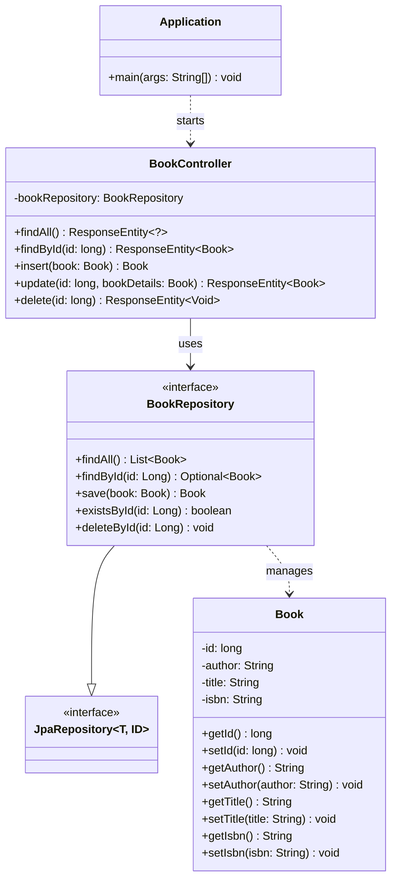

# Analysis: SpringBoot-BookService-JPA

## Purpose

This example shows how to replace an in-memory data store with real
persistence using **Spring Data JPA** against a MariaDB database. It
is the JPA-backed counterpart of the plain `SpringBoot-BookService`
example, which simulates a database with a `ConcurrentHashMap`. The
REST contract (`/api/books`, CRUD operations) is identical between
the two; only the storage mechanism changes.

## Structure

* `Application.java`
  Plain `@SpringBootApplication` bootstrap class, no custom logic.

* `Book.java`
  JPA entity: `@Entity`, `@Table(name = "books")`, `@Id` on the `id`
  field. There is no `@GeneratedValue`, so the client is responsible
  for supplying the primary key. This matches the `curl` examples in
  the README, which always send an explicit `"id"` value.

* `BookRepository.java`
  A one-line interface, `extends JpaRepository<Book, Long>`, with no
  custom query methods. It demonstrates that Spring Data JPA
  generates full CRUD support without any implementation code.

* `BookController.java`
  `@RestController` mapped to `/api/books`. The `BookRepository` is
  injected directly into the controller; there is no separate
  service layer. Endpoints: `findAll`, `findById`, `insert`
  (`POST`), `update` (`PUT`), `delete`.

* `application.properties`
  Hardcoded MariaDB credentials (`student` / `student`), database
  `testdb`, `spring.jpa.hibernate.ddl-auto=update`, and SQL/bind
  logging enabled. Acceptable for a lab setup, not for production.

* No `src/test` sources exist. The example is meant to be exercised
  manually through the `curl` walkthrough documented in `README.md`,
  not through JUnit tests.

## Class Diagram

## Findings

1. **Dead imports in `BookController.java`**
   `ArrayList`, `Map`, `UUID`, `ConcurrentHashMap`, and
   `jakarta.transaction.Transactional` are imported but never used.
   They are leftovers copied from the in-memory
   `SpringBoot-BookService` controller. Safe to remove.

2. **Inconsistent return type on `findAll()`**
   `findAll()` returns `ResponseEntity<?>` while every other method
   uses a concrete type such as `ResponseEntity<Book>`. It could be
   typed as `ResponseEntity<List<Book>>` for consistency.

3. **`update()` performs a partial, in-place mutation**
   The handler loads the existing entity and copies `author`,
   `title`, and `isbn` from the request body onto it, rather than
   replacing the entity outright. Functionally fine, but it means a
   client cannot unset a field by omitting it, which is a slight
   mismatch with typical `PUT` (full replace) semantics.

4. **Unused `@Transactional` import**
   No method is annotated `@Transactional`. Each repository call
   runs in its own auto-committing transaction. This is acceptable
   since every handler performs at most one repository operation.

5. **No automated tests**
   Unlike the DAO-JDBC-style examples elsewhere in the repository,
   this example ships no `*Test` class. Correctness is verified
   manually via the `curl` commands in `README.md`.

## Fixed Problems

6. **`POST` silently upserted instead of creating (fixed)**
   `Book.id` originally had no `@GeneratedValue`, so the client
   supplied the primary key. Because `save()` performs an `UPDATE`
   whenever the given id already exists, posting a book with an id
   already present in the database silently overwrote the existing
   row and still returned `200 OK`. Fixed by adding
   `@GeneratedValue(strategy = GenerationType.IDENTITY)` to `Book.id`
   and resetting `book.setId(0)` in `insert()` before saving, so the
   database always assigns the id and `POST` can never overwrite an
   existing row.

7. **`insert()` returned `200 OK` instead of `201 Created` (fixed)**
   `insert()` returned a bare `Book`, which Spring wraps as
   `200 OK` with no `Location` semantics, unlike the sibling
   `SpringBoot-BookService` example. Fixed by changing the return
   type to `ResponseEntity<Book>` and responding with
   `HttpStatus.CREATED`. `README.md` was updated to drop the
   client-supplied `id` from the `POST` examples and to note that
   the server now generates it.

## Comparison with `SpringBoot-BookService`

The pedagogical delta between the two examples is intentionally
small:

* `Book` gains `@Entity`, `@Table`, and `@Id` annotations.
* The manual `Map<Long, Book>` table and `nextValue()` ID sequence
  are removed from the controller.
* A `BookRepository` interface is introduced and injected via
  `@Autowired`.
* Controller method bodies are rewritten to call
  `bookRepository.findAll()`, `save()`, `existsById()`, and
  `deleteById()` instead of manipulating the in-memory map.

This isolates the Repository pattern as the single new concept
being taught, keeping the rest of the controller and entity
unchanged.

## Overall Assessment

A clean, minimal illustration of the Repository pattern layered
under a thin REST controller. The only real cleanup candidates are
the dead imports and the loose `ResponseEntity<?>` return type in
`findAll()`; everything else is consistent with the example's
teaching purpose.

*Egon Teiniker, 2026, GPL v3.0*
