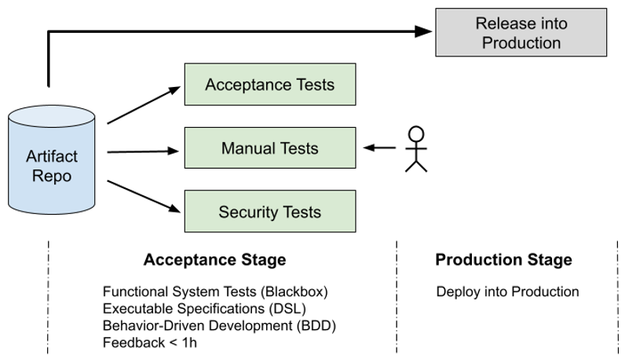
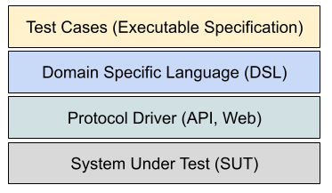

# Acceptance Tests 

Acceptance Testing is a quality assurance process used to **determine whether 
a system meets the specified requirements** and is ready for delivery. 

The focus is on **validating** that the software behaves as the stakeholders 
expect—essentially answering the question: 
**“Does the software do what users need it to do?”**

The most effective way to create an Acceptance Test is to write an **Executable Specification**, 
that describes the desired behaviour of the new piece of software, before we 
write any code. 

Acceptance Tests focus only on **what** the system should do; and say nothing about 
how it does it. So we start each test with the word **"should"**. All tests should 
be written from the user perspective.

## The Role of Acceptance Testing in CI/CD

The aims of the Acceptance Stage are:
* To evaluate changes from an external user’s perspective
* To test the system in realistic, life-like scenarios
* To assess functionality in production-like test environments
* To reduce or eliminate manual regression testing
* To build sufficient confidence that the software is functionally ready for production

\
_Figure: Continuous Delivery Process (David Farley, 2021)_

## The Four-Layer Approach

Adopting a four-layer architecture for Acceptance Test infrastructure is recommended. This approach enables the system to evolve without invalidating test cases, ensuring that tests remain robust and maintainable as requirements and implementations change.

\
_Figure: Four Layer Model of Acceptance Tests (David Farley, 2021)_

* **Executable Specifications**: This layer uses terminology and concepts from the problem domain, making test cases easy to read and understand for non-technical stakeholders. Executable Specifications serve as living documentation, bridging the gap between business requirements and technical implementation.

* **Domain Specific Language (DSL)**: This layer provides a specialized language tailored to the problem domain, allowing stakeholders to write Acceptance Test cases in clear, business-oriented terms. The DSL promotes consistency and reusability, making it easier to create, maintain, and understand Executable Specifications across the team.

* **Protocol Drivers**: This layer acts as an intermediary between the Domain Specific Language (DSL) and the System Under Test (SUT). Protocol Drivers translate high-level, business-oriented test steps into concrete actions and commands that interact directly with the system. They encapsulate the technical details required to communicate with the SUT, ensuring that test cases remain focused on user intent rather than implementation specifics. By isolating system-specific logic, Protocol Drivers make it easier to adapt tests when the underlying system changes.

* **System Under Test (SUT)**:  
The SUT represents the actual software system being evaluated by acceptance tests. It is deployed using the same tools, configurations, and processes intended for production environments. This approach ensures that tests accurately reflect real-world usage and deployment scenarios, increasing confidence that the system will perform as expected when released.

## References

* Jez Humble, David Farley. **Continuous Delivery: Reliable Software Releases through Build, Test, and Deployment Automation**. Addison-Wesley, 2010

* David Farley. **Continuous Delivery Pipelines: How To Build Better Software Faster**. Independently published, 2021

*Egon Teiniker, 2016-2025, GPL v3.0*
