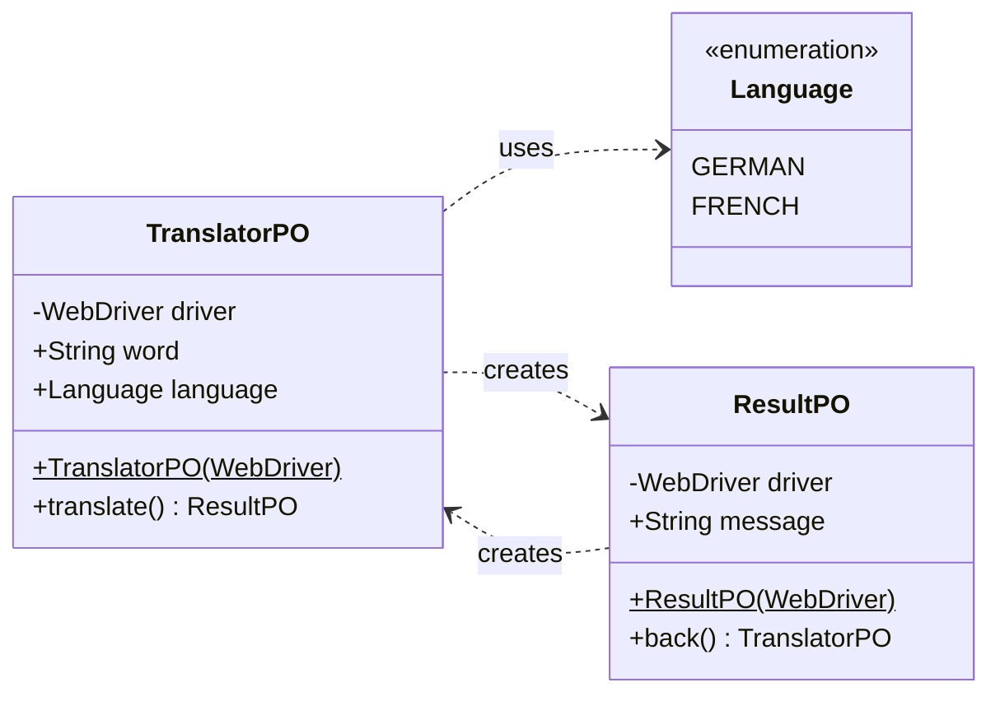

# Page Object Pattern

> A **Page Object (PO)** wraps an HTML page, or fragment, with an application-specific
> API, allowing you to manipulate page elements without digging around in 
> the HTML.

A PO allows a software client to do anything that a human can do:
* **Input fields** should be object **attributes**
* **Check boxes** should be a **Boolean values**
* **Buttons** should be represented by **methods** 
* …

The PO encapsulate the mechanics required to find and manipulate the data in the 
gui control itself. 

* These objects shouldn't usually be built for each page, but rather for the 
    significant elements on a page.

* The rule of thumb is to model the structure in the page that makes sense to 
    the user of the application.

* If we navigate to another page, the initial PO should return another PO 
    for the new page.

* PO operations should return fundamental types (strings, dates) or other page objects.

## Implementation

The following class diagram shows the page objects for a simple translator
web application:



### Page Object Class

A PO wraps a single page (or page fragment) and exposes its
elements as fields and its user actions as methods.

```java
public class TranslatorPO
{
    private WebDriver driver;

    String word;
    Language language;

    public TranslatorPO(WebDriver driver)
    {
        this.driver = driver;
        driver.get("http://localhost:8080/index.html");
    }

    public ResultPO translate()
    {
        driver.findElement(By.name("word")).click();
        driver.findElement(By.name("word")).sendKeys(word);
        driver.findElement(By.name("language")).click();
        switch(language)
        {
            case FRENCH:
                driver.findElement(
                    By.cssSelector("option:nth-child(2)")).click();
                break;
            case GERMAN:
                driver.findElement(
                    By.cssSelector("option:nth-child(1)")).click();
                break;
            default:
                throw new IllegalArgumentException(
                    "Unsupported language: " + language);
        }
        driver.findElement(
            By.cssSelector("th:nth-child(3) > input")).click();
        return new ResultPO(driver);
    }
}
```

* **Constructor**: receives a `WebDriver` instance and navigates to the
    page URL. All subsequent element lookups use this driver.

* **Fields**: represent the data a user would enter into the form.
    They are set directly by the test before triggering an action:

* **Methods**: represent user actions (clicking a button, submitting a
    form). When the action navigates to a new page, the method returns the
    page object for that page:


### Using the Page Object in Acceptance Tests

The test creates the PO, sets its input fields, calls the action
method, and asserts on the returned page object's output fields. The test
never touches `WebDriver` or HTML locators directly:

```java
@Test
public void testCatFrench()
{
    TranslatorPO translator = new TranslatorPO(driver);
    translator.word = "cat";
    translator.language = Language.FRENCH;
    ResultPO result = translator.translate();

    Assert.assertEquals("Translate: cat into Chatte", result.message);
}
```


## References

* Martin Fowler. [**Page Object**](http://martinfowler.com/bliki/PageObject.html)

* [Selenium Browser Automation](https://www.selenium.dev)

*Egon Teiniker, 2016-2026, GPL v3.0*