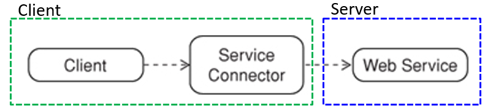

# Service Connector

> Service Connectors make services easier to use by **hiding the specifics 
> of communications-related APIs**. 
> Connectors **encapsulate many generic functions** and also include **additional 
> logic** that is quite specific to given services.

We create a **library** or set of classes that encapsulate the logic a client must 
implement in order to use a group of related services.
We also create a **high-level interface** that abstracts the details of this logic, 
thereby making the classes easier to use.

## Generic Functions Typically Handled by Connectors

* **Service location and connection management**: Connectors are responsible for 
    discovering service addresses, establishing connections to the service, and 
    capturing all connection-related exceptions.
    
    When the client has finished communicating with the service, the connector 
    disconnects from the service and releases client-side resources.

* **Request dispatch**: After connecting, the connector can send requests to the 
    service on behalf of the client application.
    
* **Response receipt**: Connectors are responsible for receiving response streams 
    as well. They may provide functions that help client applications de-serialize 
    these streams into data types they can understand.
    
    Connectors often capture all HTTP status codes returned from services as well.

## Consequences

* **Use in automatic tests**: We can modify the connector to prevent it from calling 
    the Web service and have it instantiated a **test double** for the service.

* **A convenient place to inject generic client-side behaviors**: Connectors provide 
    a place where generic cross-cutting logic can be inserted. This type of logic 
    is usually executed before requests are sent or after responses are received 
    (e.g. logging, validation, exception handling, and insertion of user credentials).
    
* **Connectors and service coupling**: All connectors are coupled to the services 
    they are build for whether or not a Service Descriptor is used.
    
    All connectors must have intimate knowledge of the service’s messages, media types, 
    and related protocols. In the case of RPC APIs, if a breaking change occurs in the 
    IDL, the client’s connector must be regenerated.
    
    The Problem is that client developers must be notified of service API changes 
    in advance so that the configurations can be made.
   
* **Location transparency**: Service connectors are often criticized because they 
    often try to hide the fact that cross-machine calls are taking place.
    Because of this, clients may not be aware of the potential latencies involved 
    and may not always implement the necessary logic to handle network-related 
    failures like lost connections, server crashes, and busy services. 
   
## References

* Robert Daigneau. **Service Design Patterns**. Addison Wesley, 2012

* Chris Richardson. **Microservices Patterns**. Manning, 2018

*Egon Teiniker, 2016-2026, GPL v3.0*
