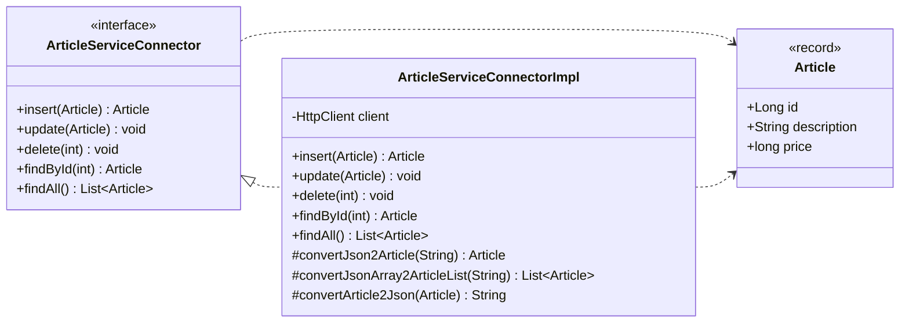

# Service Connector

> Service Connectors make services easier to use by **hiding the specifics 
> of communications-related APIs**. 
> Connectors **encapsulate many generic functions** and also include **additional 
> logic** that is quite specific to given services.


We create a **library** or set of classes that encapsulate the logic a client
must implement in order to use a group of related services.
We also create a **high-level interface** that abstracts the details of this
logic, thereby making the classes easier to use.


## Generic Functions Typically Handled by Connectors

* **Service location and connection management**: Connectors are responsible for
    discovering service addresses, establishing connections to the service, and
    capturing all connection-related exceptions.
    
    When the client has finished communicating with the service, the connector
    disconnects from the service and releases client-side resources.

* **Request dispatch**: After connecting, the connector can send requests to the
    service on behalf of the client application.
    
* **Response receipt**: Connectors are responsible for receiving response streams
    as well. They may provide functions that help client applications de-serialize
    these streams into data types they can understand.
    
    Connectors often capture all HTTP status codes returned from services as well.


## Implementation

A service connector is typically structured as shown in this Class Diagram:



### Connector Interface

The interface exposes only domain-level operations, hiding all HTTP details
from the caller:

```java
public interface ArticleServiceConnector
{
    Article insert(Article article);
    void    update(Article article);
    void    delete(int id);
    Article findById(int id);
    List<Article> findAll();
}
```

### JSON Conversion

The implementation class groups reusable serialization helpers so that the
concrete implementation stays focused on HTTP mechanics:

```java
protected Article convertJson2Article(String json)
{
    Article article = null;
    try
    {
        ObjectMapper mapper = new ObjectMapper();
        article = mapper.readValue(json, Article.class);
    }
    catch (JsonProcessingException e)
    {
        throw new IllegalStateException(e);
    }
    return article;
}

protected List<Article> convertJsonArray2ArticleList(String json)
{
    List<Article> list = null;
    try
    {
        ObjectMapper mapper = new ObjectMapper();
        list = mapper.readValue(json,
            new TypeReference<List<Article>>(){});
    }
    catch (JsonProcessingException e)
    {
        throw new IllegalStateException(e);
    }
    return list;
}

protected String convertArticle2Json(Article article)
{
    String json = null;
    try
    {
        ObjectMapper mapper = new ObjectMapper();
        json = mapper.writeValueAsString(article);
    }
    catch (JsonProcessingException e)
    {
        throw new IllegalStateException(e);
    }
    return json;
}
```

### HTTP Operations

Each interface method maps to exactly one HTTP operation.
The implementation uses `java.net.http.HttpClient` (available since Java 11).

Here an the GET operation for a single resource:

```java
@Override
public Article findById(int id)
{
    try
    {
        HttpRequest request = HttpRequest.newBuilder()
            .uri(URI.create("http://localhost:8080/articles/" + id))
            .header("Accept", "application/json")
            .GET()
            .build();

        HttpResponse<String> response =
            client.send(request, HttpResponse.BodyHandlers.ofString());
        int status = response.statusCode();
        if (status != 200)
            throw new IllegalStateException(
                "Unexpected status code: " + status);
        return convertJson2Article(response.body());
    }
    catch (IOException | InterruptedException e)
    {
        throw new IllegalStateException("Can't find article by id!", e);
    }
}
```

### Using the Connector in Acceptance Tests

The connector is the single entry point for all service calls in a test suite.
Tests work exclusively against the interface, so the underlying transport is
invisible to them:

```java
public class HttpRequestsTest
{
    private ArticleServiceConnector service;

    @Before
    public void setup()
    {
        service = new ArticleServiceConnectorImpl();
    }

	@Test
	public void testById() 
    {
        Article article = service.findById(2);
        
        Assert.assertEquals(Long.valueOf(2), article.id());
        Assert.assertEquals("Mould King 15025 Technik Muldenkipper", article.description());
        Assert.assertEquals(6956, article.price());
	}

    // ...
}
```

## Consequences

* **Use in automatic tests**: We can modify the connector to prevent it from
    calling the Web service and have it instantiated a **test double** for the
    service.

* **A convenient place to inject generic client-side behaviors**: Connectors
    provide a place where generic cross-cutting logic can be inserted. This type
    of logic is usually executed before requests are sent or after responses are
    received (e.g. logging, validation, exception handling, and insertion of user
    credentials).
    
* **Connectors and service coupling**: All connectors are coupled to the services
    they are built for whether or not a Service Descriptor is used.
    
    All connectors must have intimate knowledge of the service's messages, media
    types, and related protocols. In the case of RPC APIs, if a breaking change
    occurs in the IDL, the client's connector must be regenerated.
    
    The problem is that client developers must be notified of service API changes
    in advance so that the configurations can be made.
   
* **Location transparency**: Service connectors are often criticized because they
    often try to hide the fact that cross-machine calls are taking place.
    Because of this, clients may not be aware of the potential latencies involved
    and may not always implement the necessary logic to handle network-related
    failures like lost connections, server crashes, and busy services.
   
## References

* Robert Daigneau. **Service Design Patterns**. Addison Wesley, 2012

* Chris Richardson. **Microservices Patterns**. Manning, 2018

*Egon Teiniker, 2016-2026, GPL v3.0*
